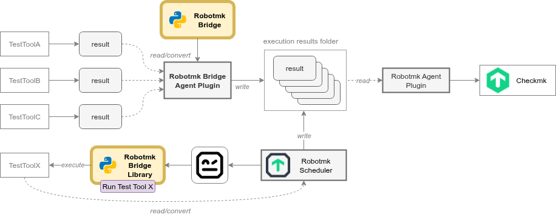

# Robotmk Bridge

_**The bridge between automation islands and your monitoring**_

Robotmk Bridge is a [Robot Framework](https://robotframework.org/) library, listener, and CLI that for external test tools to convert their results into Robot Framework results.

It is used in two modes: 

- As **Python Package**, e.g. in the [Robotmk Bridge Agent Plugin](https://github.com/elabit/robotmk-bridge-plugin)
- As a **Robot Framework Library** to run external test tools from Robot Framework tests. 

In both cases, the goal is to integrate **any test results** into [Checkmk](https://checkmk.com) monitoring with the help of [Robotmk](https://robotmk.org).



## Features

- Unifies third-party test results into the Robot Framework XML format
- Conversion is done by **Handlers**, 
  - currently there is support for
    - [JUnit](https://junit.org/junit5/) 
    - [Gatling](https://gatling.io/)
    - [OWASP ZAP](https://www.zaproxy.org/)
  - Lets you implement **custom handlers** by extending `rmkbridge.BaseHandler`.
- Working modes 
  - Use as a library `rmkbridge.RobotmkBridgeLibrary` plus the listener `rmkbridge.listener`
  - Convert existing results via CLI (`python -m rmkbridge`)

## Installation

```bash
pip install robotframework-robotmk-bridge
```

## Prerequisites

- Windows, Linux, or macOS
- [Python 3.10+](https://www.python.org/downloads/)
- [Robot Framework 6.x](https://robotframework.org) (Robot Framework 7+ support is planned)
- [pip](https://pip.pypa.io/) and any extra [requirements](requirements.txt) your handlers need

To verify the installation:

```bash
python -m rmkbridge --version
```


## Quickstart

### Option 1: Use as a Library to execute Test tools from Robot Framework

This mode consists of two steps:

1. Running the tool in Robot Framework via `Run` keyword
2. Running the Bridge-Listener

#### Step 1: Running the tool in Robot Framework

Each supported external test tool comes with a special **trigger keyword** `Run <tool>` to run the tool from inside Robot Framework.

Depending on the Handler, the keywords support individual arguments.

```robotframework
*** Settings ***
Library    rmkbridge.RobotmkBridgeLibrary

*** Test Cases ***
# runs a JUnit test
JUnit unit tests should pass
    Custom Keyword 1
    Run JUnit    path/to/results.xml    java -jar junit.jar --reports-dir path/to
    Custom Keyword 2

# runs a Gatling test
Gatling regression should stay green
    Custom Keyword 1
    Run Gatling    path/to/gatling.log    ${GATLING_HOME}/bin/gatling.sh --simulation MySimulation
    Custom Keyword 2

# Runs a ZAP test
ZAP scan finds no blockers
    Custom Keyword 1
    Run Zap    path/to/zap.json    python zap_scan.py
    Custom Keyword 2
```

#### Step 2: Running the Listener

After the suite execution, run the suite with the Robotmk Bridge **listener** so the external reports are injected into the output:

```bash
robot --listener rmkbridge.listener tests/my_suite.robot
```

The listener then creates test results using the following rules: 

- Keywords _before_ the trigger keyword are wrapped into a **Test Setup keyword**.
- **trigger keywords** (which run the tools) become **Test Cases**.
- Keywords _after_ the trigger keyword are wrapped into a **Test Teardown keyword**.

Note: you should use only 1 trigger keyword per test case. 

## Option 2: Command Line Usage to convert existing results

Use the CLI when you need to convert tool reports without running Robot Framework suites:

```bash
python -m rmkbridge rmkbridge.junit --result-file path/to/results.xml
```

- The converted file gets created next to the source as `*_robot_output.xml`.
- Similar to trigger keywords, each handler also exposes its own CLI flags. List them with `python -m rmkbridge rmkbridge.junit --help`.
- Global switches:
  - `python -m rmkbridge --print-config`
  - `python -m rmkbridge --add-config path/to/custom_handler.yml`
  - `python -m rmkbridge --reset-config`


## Keyword Documentation

- [Open the generated keyword reference](docs/index.html)
- Regenerate locally when you add handlers:

  ```bash
  python -m robot.libdoc rmkbridge.RobotmkBridgeLibrary docs/RobotmkBridgeLibrary-$(python -c "import rmkbridge; print(rmkbridge.VERSION)").html
  ```

## 🤝 Contribute Your Own Handlers!

**Robotmk Bridge** is an open-source project — and we’d love to see it grow with the help of the community!

With a growing number of handlers, our goal is to make Robotmk a truly **multi-purpose integration layer** for all kinds of test results.

If you’re working with a testing tool that isn’t supported yet, consider developing your own Bridge Handler and sharing it with others.

Every new handler expands what Robotmk can do and helps bring monitoring and test automation even closer together.

Pull requests, discussions, and ideas are always welcome!

Read more: 

- [How to write your own Handler in Python](./DEVGUIDE.md)
- [How to contribute ot the project](./CONTRIBUTION.md)


## License & Acknowledgements

RobotmkBridge stands on the shoulders of giants: the project [robotframework-oxygen](https://github.com/eficode/robotframework-oxygen), written by **Eficode Oy, Finland** 🇫🇮. 

See [ACKNOWLEDGEMENTS.md](ACKNOWLEDGEMENTS.md) for the roots of the project and credits.  

Released under the [MIT License](LICENSE).  

